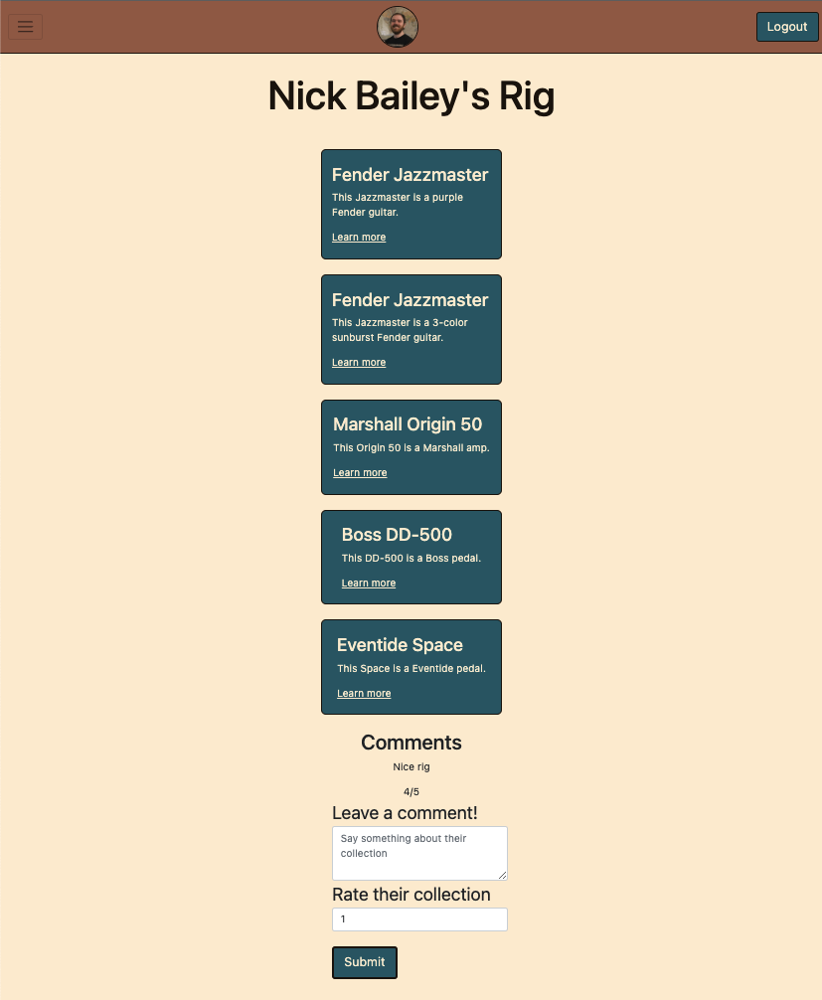

# Rig Builder

An app to create a rig by adding guitars, guitar pedals and amps to your personal rig. Log in with Google and add your gear to your profile. Comment and rate other users' rigs.

## Getting Started

[Rig Builder](https://nicks-rig-builder.herokuapp.com/) 

I used [Trello](https://trello.com/b/X2nOStz9/rig-builder) to plan this app and keep track of where I was and what steps were next. 

## Technologies used

## Next Steps

My next steps are to implement a "popular" section which will display a ranked list of the most popular gear, calculated by the number of users who have added it to their rigs. I'd also like to add a search function to search for specific pieces of gear to get a list of everyone who has it in their rigs. A super strech goal would be to implement an API to grab images for each piece of gear.
